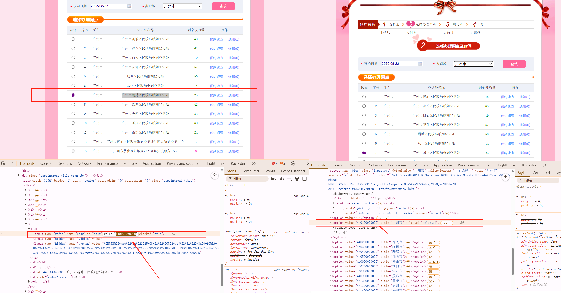

<p align="center"></p>
<h1 align="center">Marie</h1>
<p align="center">
  <a target="_blank" href="https://kyrieliu.cn"></a>
  <a href="javascript:void(0)"></a>
  <a href="javascript:void(0)"></a>
  <a target="_blank" href="https://kyrieliu.cn/images/qrcode.jpg"></a>
</p>
  
## :sparkles: 介绍
Marie 是一个用来让「广东省结婚预约流程」更快的 Chrome 浏览器插件，让使用者**快人一步，大大增加抢到好日子的概率**。  
<p aligh="center"></p>  

首先，你只能在[广东省民政局的 PC 端官网](https://www.gdhy.gov.cn/wsyy/index.jsp)上使用 marie。
其次，因为一些客观因素， marie 并不能让整个预约流程都变成自动化，能帮到你的地方有：  
1. 在你手动输入验证码后，自动进入「婚姻登记预约流程」
2. 自动填充「双方基本信息」并进入下一步
3. 自动选择「预约日期」和「预约登记城市」，自动点击查询按钮
4. 自动填充「双方个人信息」并根据身份证号「自动带出生日信息」
  
  
💍 我用这个小工具，[成功预约到了 2022 年 5 月 21 日在深圳领证！](https://mp.weixin.qq.com/s/GFRXOsCjGNvi7lU5NwHWyw)  
  
<br><br><br>

## :bookmark: 使用指引
### :star: 点击 star
在 Github 上点击 star，就会持续关注当前项目（可通过个人主页快速找到当前项目）；以及，可以小小的满足一下作者的虚荣心，为以后的迭代提供动力。
> 科普：star 相当于关注/收藏/点赞。  
  
<br>

### :loop: 点击 fork 并自定义配置文件
Fork 之后，你就可以在这份「自己的代码」仓库中进行定制化的配置了。  
Marie 将一切可以 DIY 的变量都放在了配置文件 ```src/content_scripts/marriage.js``` 中的 `info` 变量中，每个字段上都标记了详细的注释。需要注意的是，每个字段的的 `value` 是一个对象，这个对象中的 `editor` 字段对应的是民政局官网上的 DOM 节点 ID，**无需更改**，只需要更改 `value` 字段即可。  
 ```javascript
// ...
const info = {
  maleInfo: {
    name, // 姓名（必填）
    id, // 身份证号（必填）
    degree, // 文化程度（必须是页面上有的选项，可去自行查看）
    job, // 职业（必须是页面上有的选项，可去自行查看）
    phone, // 手机号码
  },

  femaleInfo: {
    // 和男方信息一样
  },

  address: {
    date, // 预约日期，默认值 '2023-05-20'
    city, // 预约办理城市，默认值为广州（统计用区划代码）
    officeList, // 意向办理网点列表，会依次尝试选择，建议多填几个志愿以免抢不到
    timeList, // 意向办理时间列表，会依次尝试选择
  },

  notifyValue, // 短信通知选择男方/女方手机号 01: 男 02: 女
}
// ...
```
  
### :rotating_light: 注意！注意！注意！
1. 在第一页的基本信息中，双方的「人员类别」、「国家或地区」分别默认为“内地居民”、“中国”，所以在本插件的配置中并没有提供自定义，如有需要请自行魔改或给我提 ISSUE
2. 页面上的办理城市实际参数值是**统计用区划代码**，建议提前在[预约系统网页](https://www.gdhy.gov.cn/) f12 打开控制台查询，办理网点的值同理。如图，广州的代码为 `440100000000`，广州市越秀区民政局婚姻登记处的代码为 `4401040A0000`

<p align="center"></p>

  
### :calling: 将 marie 安装到 Chrome
在地址栏输入 `chrome://extensions` 打开扩展管理页面后，通过 `加载已解压的扩展程序` 将 marie 安装到 chrome 中（请选中 marie 的根目录）。  
添加成功后，就可以开始使用了。  
> 虽然是自动化工具，但 marie 仍然提供了两个按钮：「基本信息」和「人员信息」，用来在发生意外时手动触发信息的填充，一般情况下用不到。
  
<br>

### :rocket: 安装 Chromne 插件
修改完配置检查没问题后，就可以在 Chrome 浏览器中加载并使用了。  
  
<br><br><br>

## :flags: 未来规划
- 提供经过构建的最小化版本（其实也没必要？）
  
:star2: 如果 Marie 对你有帮助（或即将对你有帮助），欢迎用 star 来表达对我的支持，Thx～   
如果你希望第一时间 get 我的新开源项目，一定要记得在 Github 上关注我～
  
<br><br><br>

## :star: Star 趋势
[](https://star-history.com/#kkkyrie/marie&Date)  
实时更新中...

<br><br><br>

## :green_heart: 最后
关注我的个人原创公众号，第一时间 get 更多好玩有趣的文章/项目，让前端变得更有趣 :stuck_out_tongue_closed_eyes:  
<p align="center"></p>
